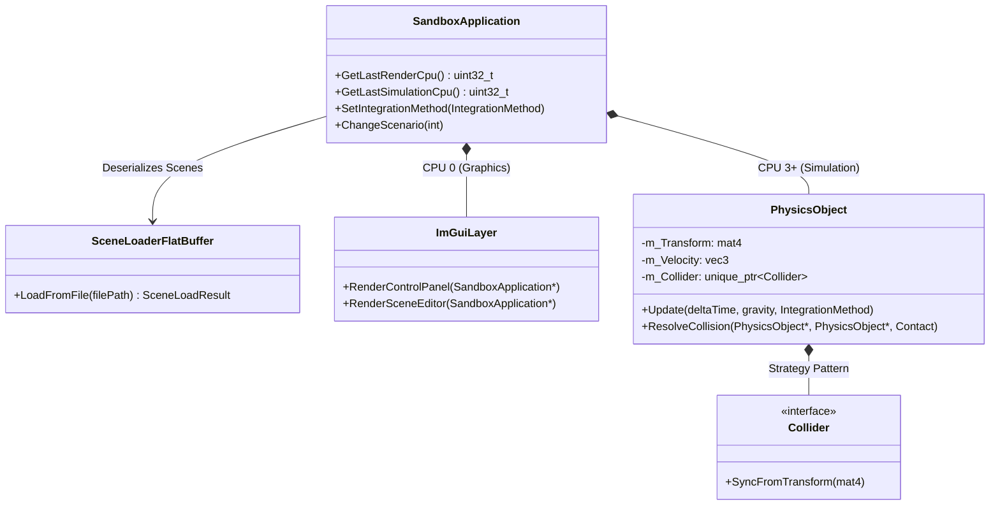
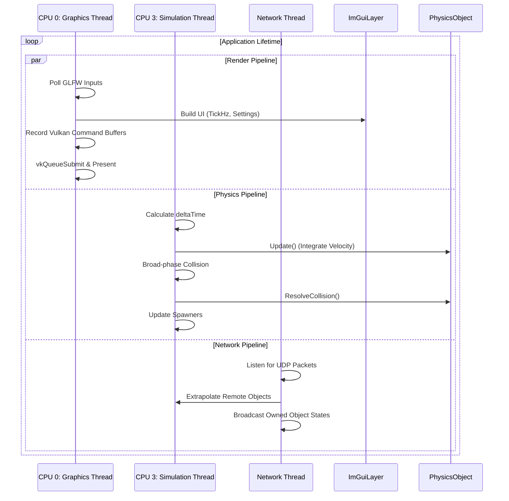

# Concurrency Report

## Part 1: System Architecture, Threads, and Networking

### 1.1 Core Architecture and Data-Driven Design

The simulation engine is built upon a highly decoupled, data-driven architecture written in C++ and utilizing Vulkan for rendering. To achieve rapid loading times and avoid the runtime overhead of parsing text-based formats, the engine serializes scene configurations (including objects, spawners, flocking settings, and physics properties) into binary FlatBuffers (`.bin` files).

The `SceneLoaderFlatBuffer` class acts as the bridge between the serialized data and the runtime environment, mapping FlatBuffer structs to the engine's internal `SimRuntime` configurations. This allows complex scenes, such as `scene_second_test.json` — which contains animated kinematic objects, multiple spawner types (e.g., `CylinderSpawner`, `CapsuleSpawner`), and diverse materials (steel, rubber) — to be instantiated efficiently.

The core entity within the engine is the `PhysicsObject`. It encapsulates the physical state (transform, velocity, angular velocity, mass, inertia) and delegates geometric boundary definitions to polymorphic `Collider` classes (`SphereCollider`, `BoxCollider`, `PlaneCollider`).

---

### 1.2 Concurrency Model and Processor Affinity

To maximize performance and prevent the physics simulation from bottlenecking the Vulkan rendering pipeline, the engine employs a multi-threaded architecture. The workload is strictly partitioned:

- **Graphics Thread:** The main thread handles the Vulkan swapchain, command buffer recording, and the ImGui layer.
- **Simulation Thread:** A dedicated thread executes the physics integration, collision detection, and spawner logic.

To further optimize cache coherency and minimize context-switching overhead, the engine enforces strict processor affinity. The `ImGuiLayer` monitors and exposes these metrics, confirming that the render thread is isolated to CPU 0, while the simulation thread is pinned to CPU 3 or higher (`GetLastSimulationCpu()`). Furthermore, the UI allows for real-time adjustments and monitoring of both the `SimulationTickHz` and `RenderTickHz`, ensuring the decoupling functions correctly under heavy loads.

---

### 1.3 P2P Networking and Ownership

The networking architecture utilizes a Peer-to-Peer (P2P) topology designed for 2 to 4 peers. To resolve the inherent conflicts of running deterministic physics across a network with latency, the engine uses an authoritative "Ownership" model.

As defined in `SceneRuntime.h` and the FlatBuffer schemas, every `SimulatedObject` and `BaseSpawnerDef` is assigned a `SpawnerOwnerType` (e.g., `One`, `Two`, `Sequential`).

- **Authority:** A peer only executes the full `PhysicsObject::Update` and `ResolveCollision` routines for objects matching its assigned ID.
- **Synchronization:** The networking thread (running concurrently) serializes the transformation matrices, linear velocities, and angular velocities of locally owned objects and transmits them to peers.
- **Correction & Extrapolation:** For objects owned by remote peers, the local engine acts as a "dumb client," updating positions based on received network packets. If packets are delayed or lost, the engine uses the last known linear and angular velocity to extrapolate the object's position, ensuring visual smoothness until the next authoritative state arrives.

---

### 1.4 Architecture UML Diagrams

#### Class Diagram: Core Systems

## 2. Advanced Simulation Feature: Flocking (Boids)

### 2.1 Independent Research Evidence
To transition the engine from basic rigid-body dynamics to complex, emergent behavior, a flocking system was researched and implemented based on Craig Reynolds' Boids algorithm. Rather than scripting explicit paths, each agent dynamically calculates its trajectory based on a weighted sum of three local steering behaviors:
* **Separation:** Steering away from neighbors to avoid overcrowding and collisions.
* **Alignment:** Steering to match the average velocity and heading of nearby flockmates.
* **Cohesion:** Steering toward the average spatial position (center of mass) of local flockmates.

### 2.2 Implementation and Optimization
* **Data-Driven Configuration:** The flocking parameters (such as `neighborRadius`, `maxSpeed`, and individual behavior weights) are mapped via Google FlatBuffers within the `FlockingSettingsDef` struct[cite: 2]. This allows rapid iteration and tuning of the biological behaviors directly via JSON without recompiling the C++ engine[cite: 2].
* **Concurrency Integration:** Because neighbor-distance calculations inherently scale at $O(n^2)$ complexity, the flocking update logic is strictly executed on the dedicated Simulation Thread pinned to CPU 3 or higher[cite: 3]. This architectural decision ensures that the heavy mathematics of multi-agent interactions do not bottleneck the Vulkan graphics pipeline running on CPU 0[cite: 3].
#### Sequence Diagram: Multi-threaded Execution Loop

