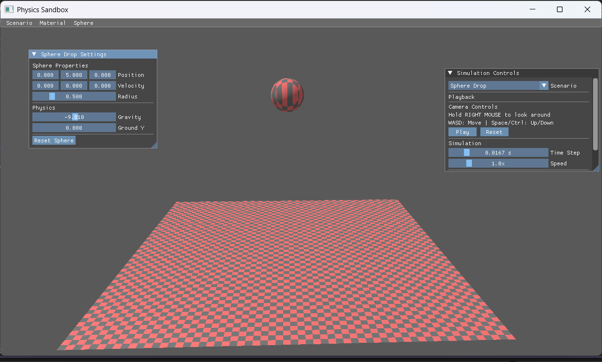
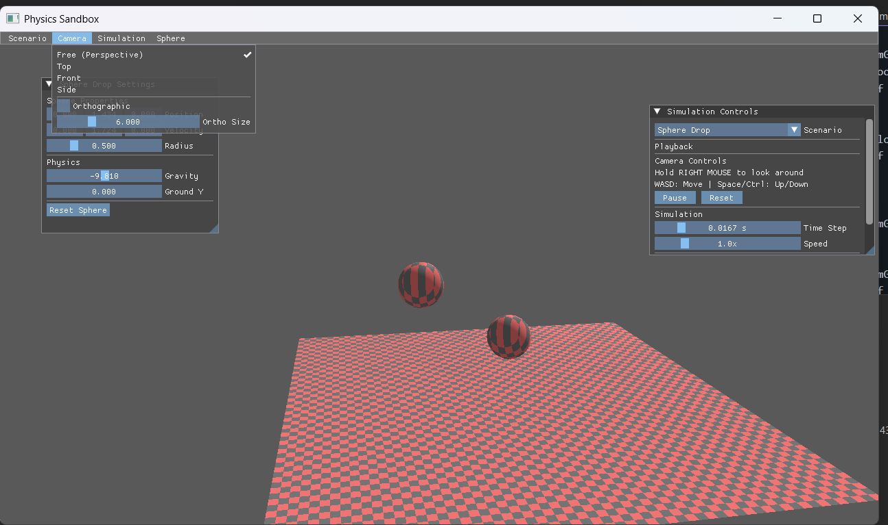

# Simulation Lab Book

## Week 2 - Lab 2

February 15, 2026

### Q1. Scenario Management with ImGui Main Menu

**Question:**
Be able to load and unload different scenarios easily. Provide an ImGui Main Menu Bar with a Scenario menu to switch active scenarios. Allow scenarios to add their own main-menu UI (e.g., colour picker to change background). OnLoad and OnUnload should be virtual in the base Scenario class.

**Solution:**
```c++
void ImGuiLayer::RenderMainMenuBar(SandboxApplication* app) {
    if (!ImGui::BeginMainMenuBar()) {
        return;
    }

    if (ImGui::BeginMenu("Scenario")) {
        for (int i = 0; i < static_cast<int>(m_ScenarioNames.size()); i++) {
            bool isSelected = (m_SelectedScenarioIndex == i);
            if (ImGui::MenuItem(m_ScenarioNames[i].c_str(), nullptr, isSelected)) {
                m_SelectedScenarioIndex = i;
                app->ChangeScenario(i);
            }
        }
        ImGui::EndMenu();
    }

    if (auto* scenario = app->GetCurrentScenario()) {
        scenario->ImGuiMainMenu();
    }

    ImGui::EndMainMenuBar();
}
```

**Test data:**
- Switch between `Clear Color` and `Sphere Drop` from the main menu.
- Change background color using the `Colour` menu.
- Confirm OnUnload/OnLoad occur by observing reset state after switching.

**Sample output:**
>
>

**Reflection:**
- Centralizing scenario selection in the main menu keeps switching consistent and visible.
- A dedicated `ImGuiMainMenu` hook lets each scenario contribute unique controls.
---

### Q2. Be able to render primitive shapes

**Question:**
We want to find the shortest distance between the line and a general point PG . The shortest distance from the point PG to the line will form a right angle with the line. 
There are lots of approaches to calculate this. One way to think about this problem is to imagine a right angled triangle between the point on the line PL, the general point PG, and the unknown point that forms the right angle. 

**Solution:**
```c++
#include "PhysicsObject.h"

void PhysicsObject::SetPosition(const glm::vec3& position) {
    m_Transform[3] = glm::vec4(position, 1.0f);
}

void PhysicsObject::SetOrientation(const glm::quat& orientation) {
    glm::vec3 position = GetPosition();
    m_Transform = glm::mat4_cast(orientation);
    m_Transform[3] = glm::vec4(position, 1.0f);
}

void PhysicsObject::SetOrientationEuler(const glm::vec3& eulerRadians) {
    SetOrientation(glm::quat(eulerRadians));
}


void SphereDropScenario::OnRender(VkCommandBuffer commandBuffer) {
    auto& material = m_App->GetMaterialSettings();

    PushConstants groundPush{};
    groundPush.model = m_GroundObject.GetTransform();
    groundPush.checkerColorA = material.lightColor;
    groundPush.checkerColorB = material.darkColor;
    groundPush.checkerParams = glm::vec4(material.checkerScale, 0.0f, 0.0f, 0.0f);

    vkCmdPushConstants(commandBuffer,
        m_App->GetPipelineLayout(),
        VK_SHADER_STAGE_VERTEX_BIT | VK_SHADER_STAGE_FRAGMENT_BIT,
        0, sizeof(PushConstants), &groundPush);

    VkBuffer vertexBuffers[] = { m_GroundBuffers.vertexBuffer };
    VkDeviceSize offsets[] = { 0 };
    vkCmdBindVertexBuffers(commandBuffer, 0, 1, vertexBuffers, offsets);
    vkCmdBindIndexBuffer(commandBuffer, m_GroundBuffers.indexBuffer, 0, VK_INDEX_TYPE_UINT32);
    vkCmdDrawIndexed(commandBuffer, m_GroundBuffers.indexCount, 1, 0, 0, 0);

    PushConstants spherePush{};
    spherePush.model = m_SphereObject.GetTransform();
    spherePush.checkerColorA = material.lightColor;
    spherePush.checkerColorB = material.darkColor;
    spherePush.checkerParams = glm::vec4(material.checkerScale, 0.0f, 0.0f, 0.0f);

    vkCmdPushConstants(commandBuffer,
        m_App->GetPipelineLayout(),
        VK_SHADER_STAGE_VERTEX_BIT | VK_SHADER_STAGE_FRAGMENT_BIT,
        0, sizeof(PushConstants), &spherePush);

    vertexBuffers[0] = m_SphereBuffers.vertexBuffer;
    vkCmdBindVertexBuffers(commandBuffer, 0, 1, vertexBuffers, offsets);
    vkCmdBindIndexBuffer(commandBuffer, m_SphereBuffers.indexBuffer, 0, VK_INDEX_TYPE_UINT32);
    vkCmdDrawIndexed(commandBuffer, m_SphereBuffers.indexCount, 1, 0, 0, 0);
}
```

**Test data:**
- Plane mesh renders with checkerboard pattern.
- Sphere mesh renders with same material.
- Material menu changes checkerboard colors/scale in real time.

**Sample output:**


**Reflection:**
- Push constants allow per‑object material overrides without extra descriptor sets.
- Model‑space checkerboarding makes rotation visually obvious and provides fast validation.
---


### Q3. Sphere–Line Intersection Test (Summative)

**Question:**
To create meaningful simulations you need to be able to Simulate objects colliding with one another,

**Solution:**
```c++


void ImGuiLayer::RenderMainMenuBar(SandboxApplication* app) {
    if (!ImGui::BeginMainMenuBar()) {
        return;
    }

    if (ImGui::BeginMenu("Scenario")) {
        for (int i = 0; i < static_cast<int>(m_ScenarioNames.size()); i++) {
            bool isSelected = (m_SelectedScenarioIndex == i);
            if (ImGui::MenuItem(m_ScenarioNames[i].c_str(), nullptr, isSelected)) {
                m_SelectedScenarioIndex = i;
                app->ChangeScenario(i);
            }
        }
        ImGui::EndMenu();
    }

    if (ImGui::BeginMenu("Camera")) {
        if (ImGui::MenuItem("Free (Perspective)", nullptr, app->GetCameraView() == CameraView::Perspective)) {
            app->SetCameraView(CameraView::Perspective);
        }
        if (ImGui::MenuItem("Top", nullptr, app->GetCameraView() == CameraView::Top)) {
            app->SetCameraView(CameraView::Top);
        }
        if (ImGui::MenuItem("Front", nullptr, app->GetCameraView() == CameraView::Front)) {
            app->SetCameraView(CameraView::Front);
        }
        if (ImGui::MenuItem("Side", nullptr, app->GetCameraView() == CameraView::Side)) {
            app->SetCameraView(CameraView::Side);
        }

        ImGui::Separator();
        bool ortho = app->IsOrthographic();
        if (ImGui::Checkbox("Orthographic", &ortho)) {
            app->SetOrthographic(ortho);
        }
        float orthoSize = app->GetOrthoSize();
        if (ImGui::SliderFloat("Ortho Size", &orthoSize, 2.0f, 20.0f)) {
            app->SetOrthoSize(orthoSize);
        }

        ImGui::EndMenu();
    }

    if (ImGui::BeginMenu("Simulation")) {
        if (ImGui::MenuItem(app->IsPaused() ? "Start" : "Pause")) {
            app->TogglePause();
        }
        if (ImGui::MenuItem("Step")) {
            app->StepOnce();
        }

        float timeStep = app->GetTimeStep();
        if (ImGui::SliderFloat("Time Step", &timeStep, 0.001f, 0.1f, "%.4f s")) {
            app->SetTimeStep(timeStep);
        }
        ImGui::EndMenu();
    }

    if (auto* scenario = app->GetCurrentScenario()) {
        scenario->ImGuiMainMenu();
    }

    ImGui::EndMainMenuBar();
}
```


**Test data:**
- Start/Pause toggles simulation.
- Step advances exactly one fixed timestep.
- Time step slider changes update frequency.

**Sample output:**


**Reflection:**
- Fixed timestep ensures deterministic updates and stable collisions.